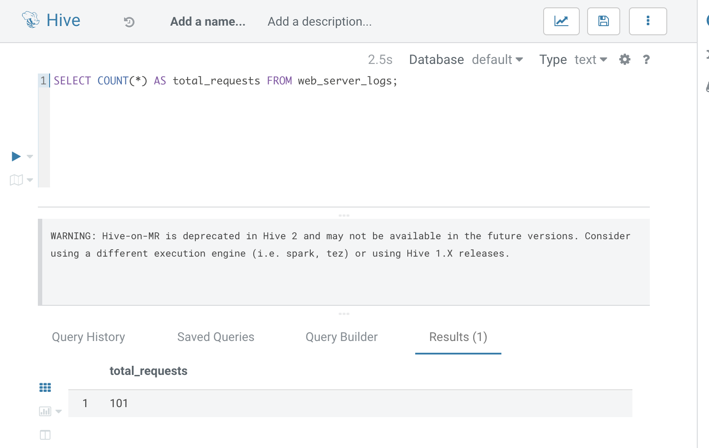
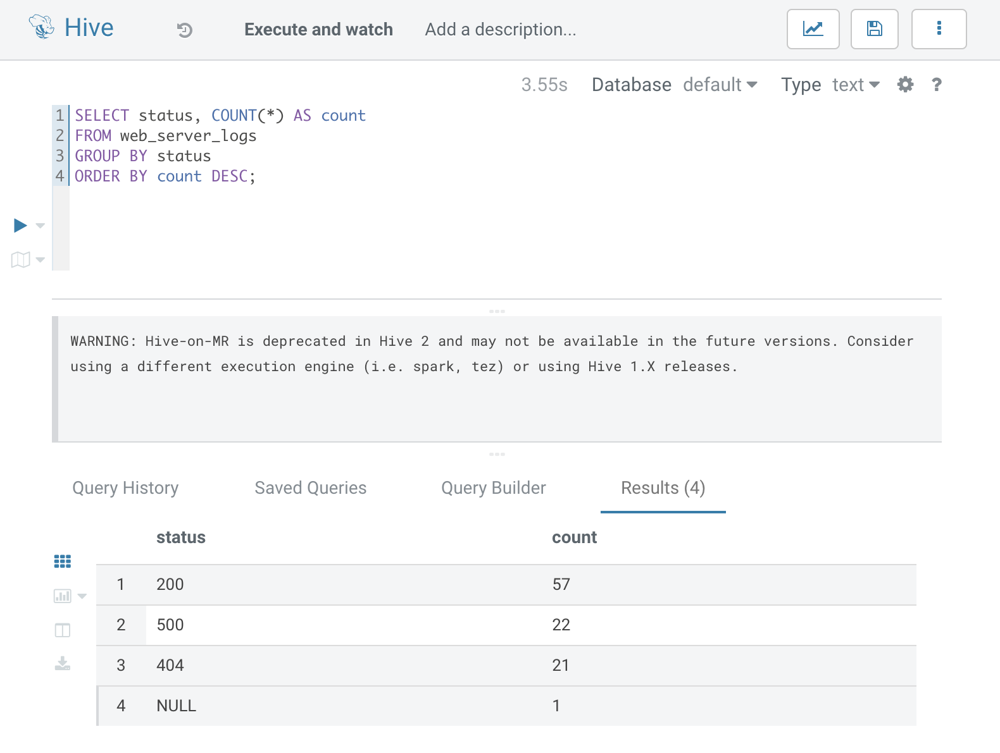
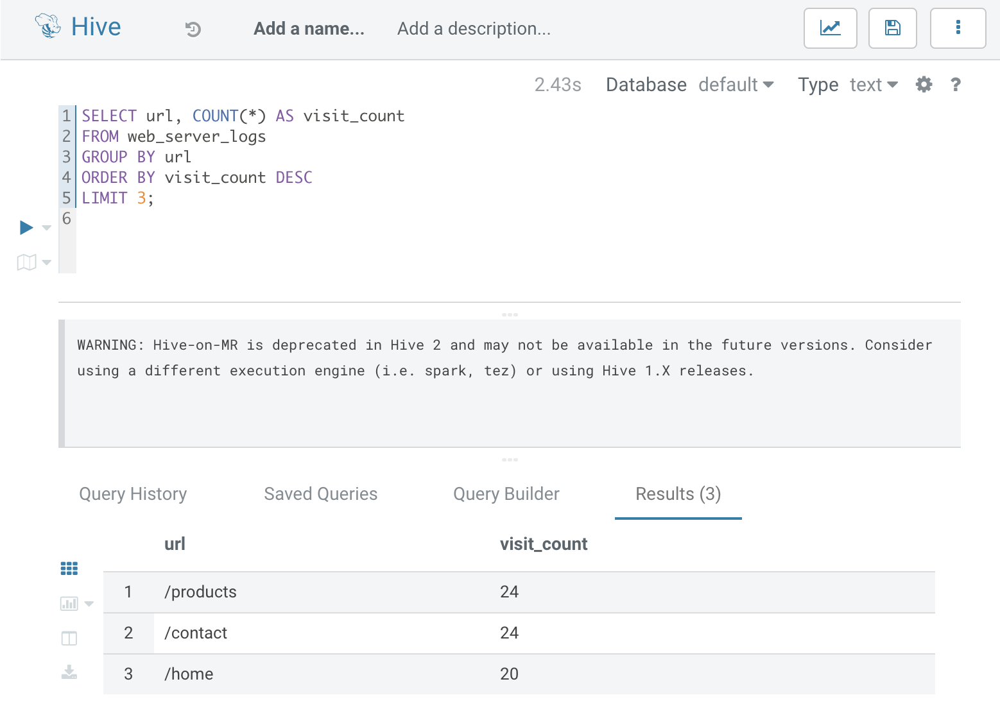
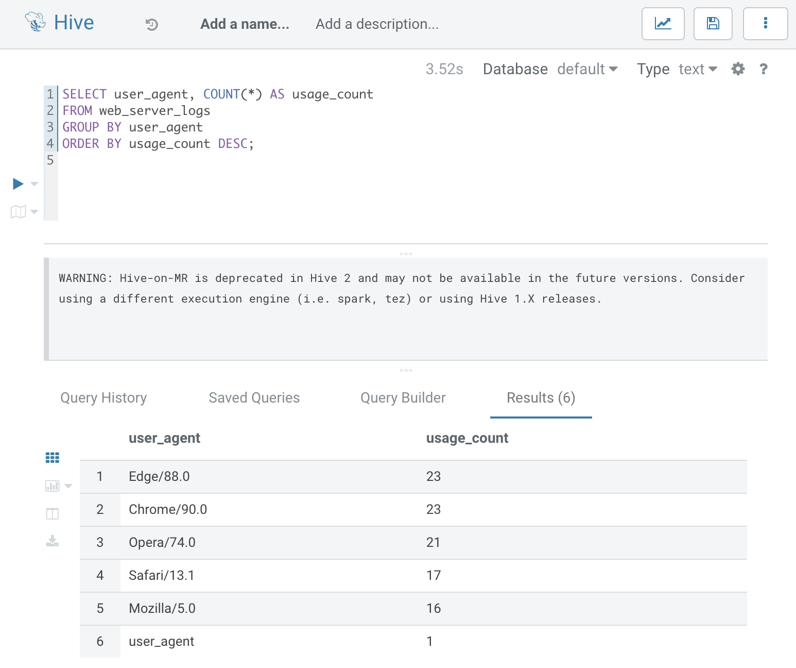
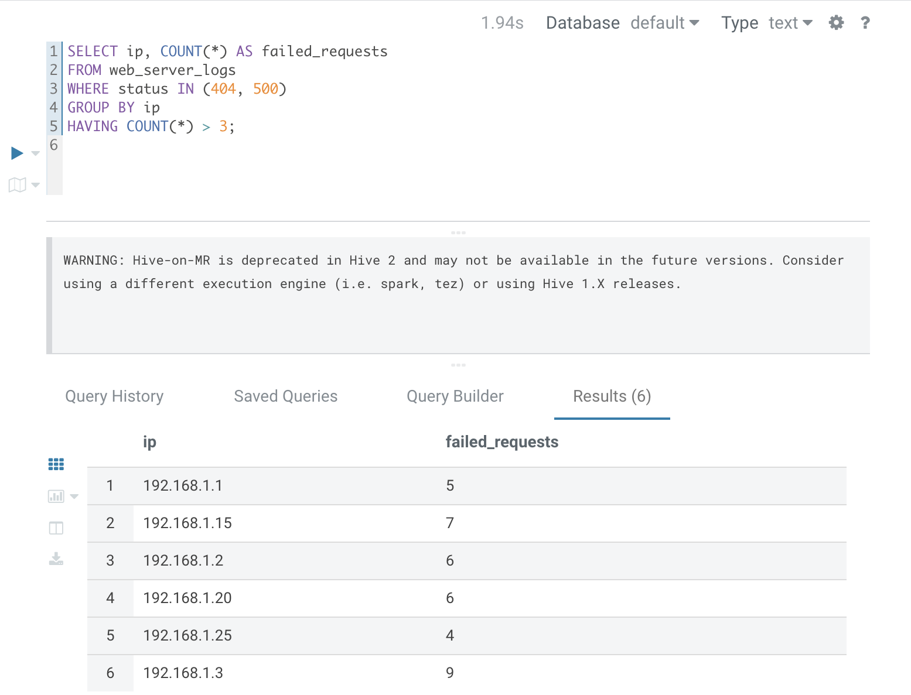
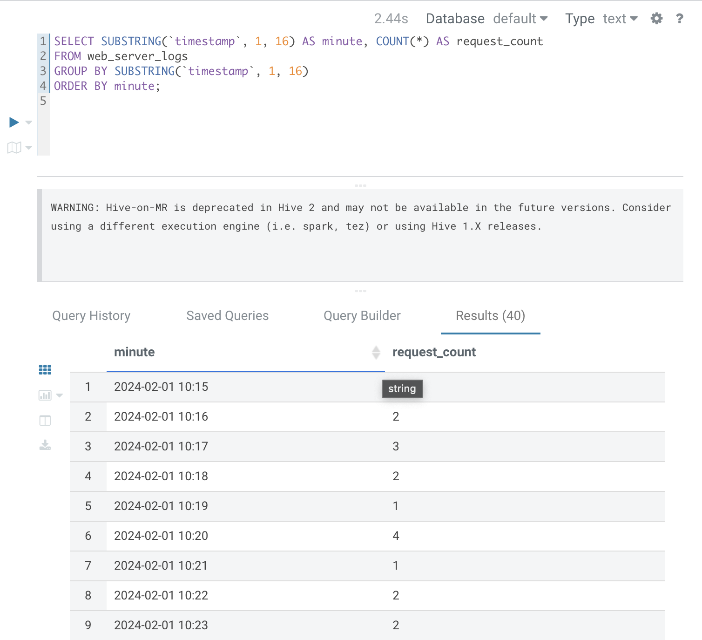
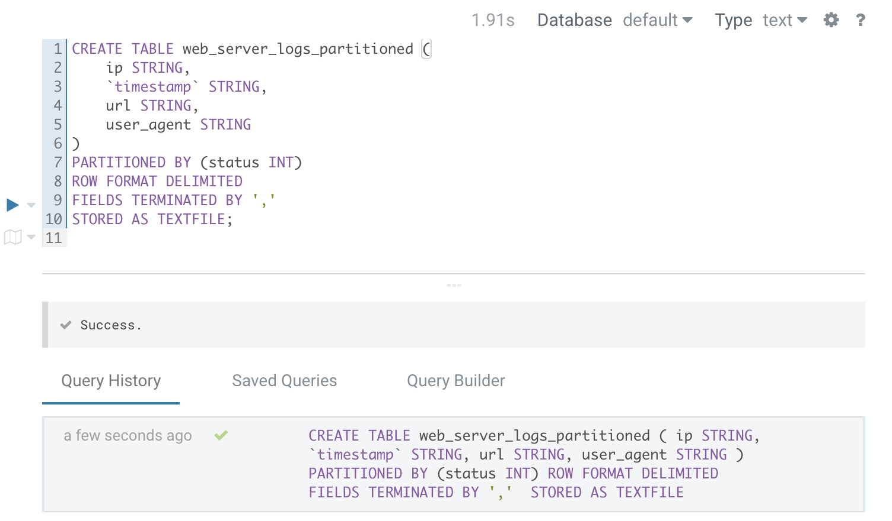
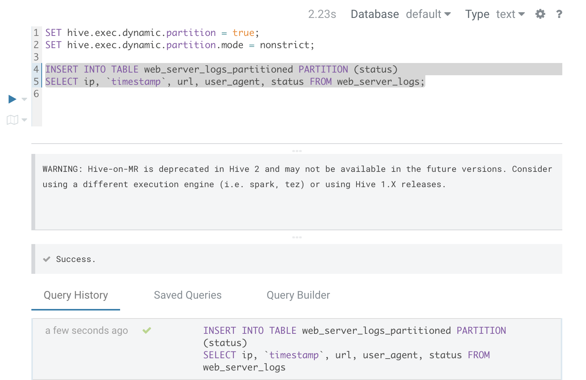

Project Overview
This project analyzes web server logs using Apache Hive to extract insights into website traffic patterns. The dataset consists of log entries in CSV format, including IP addresses, timestamps, requested URLs, HTTP status codes, and user agents.

Key Objectives:
Count Total Web Requests
Analyze HTTP Status Codes
Identify the Most Visited Pages
Analyze Traffic Sources (User Agents)
Detect Suspicious IP Activity (Failed Requests)
Analyze Traffic Trends (Requests Per Minute)
Optimize Query Performance with Partitioning

Implementation Approach
Each analysis task is implemented using HiveQL queries on a structured dataset stored in HDFS.

1. Creating the Hive Table

CREATE EXTERNAL TABLE IF NOT EXISTS web_server_logs (
    ip STRING,
    `timestamp` STRING,  -- Escaped reserved keyword
    url STRING,
    status INT,
    user_agent STRING
)
ROW FORMAT DELIMITED 
FIELDS TERMINATED BY ',' 
STORED AS TEXTFILE 
LOCATION '/user/hive/warehouse/web_logs';


2. Loading Data into Hive Table
Upload the CSV file into HDFS:

hdfs dfs -mkdir -p /user/hive/warehouse/web_logs
hdfs dfs -put web_logs.csv /user/hive/warehouse/web_logs/

Load data into Hive Table:
LOAD DATA INPATH '/user/hive/warehouse/web_logs/web_logs.csv' INTO TABLE web_server_logs;

Queries for Analysis
1. Total Web Requests
SELECT COUNT(*) AS total_requests FROM web_server_logs;



2. HTTP Status Code Analysis

SELECT status, COUNT(*) AS count 
FROM web_server_logs 
GROUP BY status 
ORDER BY count DESC;



3. Top 3 Most Visited Pages
SELECT url, COUNT(*) AS visit_count 
FROM web_server_logs 
GROUP BY url 
ORDER BY visit_count DESC 
LIMIT 3;



4. Most Common User Agents

SELECT user_agent, COUNT(*) AS usage_count 
FROM web_server_logs 
GROUP BY user_agent 
ORDER BY usage_count DESC;



5. Detect Suspicious IPs (More Than 3 Failed Requests)

SELECT ip, COUNT(*) AS failed_requests 
FROM web_server_logs 
WHERE status IN (404, 500) 
GROUP BY ip 
HAVING COUNT(*) > 3;



6. Requests Per Minute (Traffic Trend Analysis)

SELECT SUBSTRING(timestamp, 1, 16) AS minute, COUNT(*) AS request_count 
FROM web_server_logs 
GROUP BY SUBSTRING(timestamp, 1, 16) 
ORDER BY minute;



7. Optimizing Queries with Partitioning
7.1 Creating a Partitioned Table (by Status Code)

CREATE TABLE web_server_logs_partitioned (
    ip STRING,
    timestamp STRING,
    url STRING,
    user_agent STRING
)
PARTITIONED BY (status INT)
ROW FORMAT DELIMITED 
FIELDS TERMINATED BY ',' 
STORED AS TEXTFILE;



7.2 Loading Data into Partitioned Table
SET hive.exec.dynamic.partition = true;
SET hive.exec.dynamic.partition.mode = nonstrict;

INSERT INTO TABLE web_server_logs_partitioned PARTITION (status)
SELECT ip, timestamp, url, user_agent, status FROM web_server_logs;



7.3 Querying Partitioned Data (Faster Execution)

SELECT COUNT(*) FROM web_server_logs_partitioned WHERE status = 404;


Execution Steps
Step 1: Setup Hive Environment

```bash
hive
```
Step 2: Create the Hive Table
Run the table creation script in Hive.
```bash
hdfs dfs -mkdir -p /user/hive/warehouse/web_logs
hdfs dfs -put web_logs.csv /user/hive/warehouse/web_logs/
```

Step 3: Load the Web Logs into HDFS
```bash
hdfs dfs -mkdir -p /user/hive/warehouse/web_logs
hdfs dfs -put web_logs.csv /user/hive/warehouse/web_logs/
```
Step 4: Load Data into Hive Table
```bash
LOAD DATA INPATH '/user/hive/warehouse/web_logs/web_logs.csv' INTO TABLE web_server_logs;
```
Step 5: Execute Queries
Run the queries for analysis in Hive.

Step 6: Implement Partitioning
Run the partitioning queries for optimized performance.

